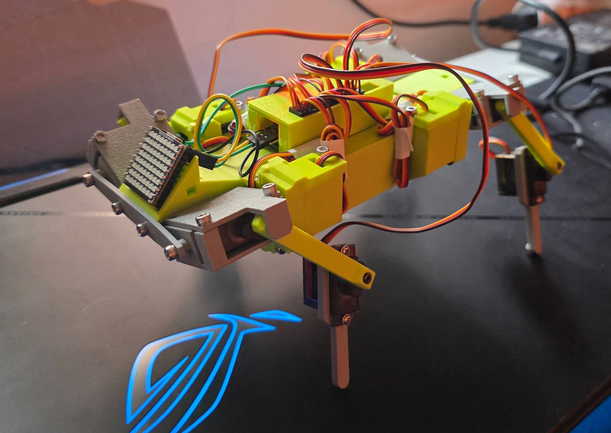

# DOT

3D printed 12-DOF quadruped robot. ESP32, MG90S servos.
<p align="center">
  
</p>
**Status:** v1.0 bring-up. IK works on single legs. Full walking is unreliable, debugging.

---

## Current status

- [x] CAD v1 printed
- [x] Servo calibration sketch
- [x] Single-leg IK test
- [ ] Stable standing pose
- [ ] Crawl gait
- [ ] IMU feedback
- [ ] URDF / Isaac Sim model

---

## Repo

- `firmware/dot_calibrate/` — sets every servo to a single angle. Used for assembly and inversion check.
- `firmware/dot_ik_test/` — commands one leg to a target position via IK.
- `CAD/3mf/` — printable files
- `CAD/step/` — coming later
- `docs/kinematics.md` — FK + IK derivations
- `docs/wiring.md` — wiring reference
- `docs/calibration.md` — servo zeroing procedure

---

## Parts

**Electronics**

- 12x MG90S micro servo ([Waveshare](https://www.waveshare.com/mg90s-servo.htm))
- Waveshare ESP32-S3-Matrix — ESP32-S3, 8x8 RGB face, onboard QMI8658 6-axis IMU
- PCA9685 16-channel PWM driver
- 2x18650 Lithium Battery Shield, 5V 3A / 3V 1A out
- 2x 18650 Li-ion cell
- Wire

**3D printed**

Each 3MF contains the right part count and mirroring. Print each file once.

- `body`
- `body_top`
- `front_mount`
- `hip_servo_holder`
- `upper_servo_holder`
- `upper_servo_cover`
- `leg_upper`
- `leg_lower`
- `pca9685_cover`

PLA. Settings embedded in each 3MF (Bambu Studio).

**Hardware**

- M3 screws
- M3 heat-set inserts

---

## Wiring

ESP32-S3-Matrix → PCA9685 over I2C. Servos plug into PCA9685 channels 0–11. Full pinout in [docs/wiring.md](docs/wiring.md).

```
PCA9685 SDA -> ESP32 GPIO 34
PCA9685 SCL -> ESP32 GPIO 33
PCA9685 VCC -> 3.3V
GND         -> GND
Servo V+    -> battery shield 5V rail
```

Don't power servos off the ESP32's 5V.
---

## Flash

Arduino IDE, `esp32` core 2.0+ from Boards Manager.

Libraries:

- Adafruit PWM Servo Driver Library
- Wire (built-in)

Board: `ESP32S3 Dev Module`. Upload over USB-C.

---

## Assemble

Calibrate before mounting any of the legs. Otherwise the software's 90° won't match the physical 90° and the IK will be off. Full procedure in [docs/calibration.md](docs/calibration.md).

1. Flash `firmware/dot_calibrate/` — sets every servo to the angle defined at the top of the sketch.
2. Set the angle to 90°, run it, watch all 12 servos.
3. Some servos end up mounted mirrored. Note which ones rotate the wrong way, add their indices to the `INVERTED` list at the top of the sketch, reflash.
4. Re-run. All servos should now move the right direction for a positive angle change.
5. With servos still holding 90°, mount the leg parts. Leg link first, then knee link. Tighten the horn screws while the leg is in its neutral pose.
6. Repeat for all four legs.

---

## Math

Forward and inverse kinematics for the 3R leg chain. Derivations in [`docs/kinematics.md`](docs/kinematics.md).

Validated in Desmos:

- [FK](https://www.desmos.com/3d/erax4k9wia)
- [IK](https://www.desmos.com/3d/gpihu2vkmm)

In the Desmos files, `L1` is the leg length and `O` is the ab/ad offset. The rest of the variables are self-evident. Better diagrams will come with the full derivation in `docs/kinematics.md`.

Still to do: Jacobian, workspace analysis, foot trajectories, parameterized gait.

---

## TODO

- [ ] Hero photo + demo video
- [ ] Wiring diagram
- [ ] Face animations on the LED matrix
- [ ] Fix walking
- [ ] Walking gait code
- [ ] Better servos for hip and knee
- [ ] Cable cover design — maybe
- [ ] Jacobian + workspace
- [ ] Foot trajectory generation
- [ ] Parameterized gait controller
- [ ] IMU in the control loop
- [ ] URDF
- [ ] Isaac Lab pipeline
- [ ] Sim-to-real writeup

---

## License

- Code (`firmware/`): MIT — see [LICENSE](LICENSE)
- CAD (`CAD/`): CC BY-SA 4.0 — see [CAD/LICENSE](CAD/LICENSE)
